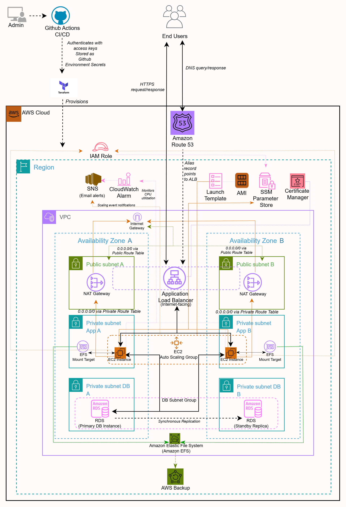
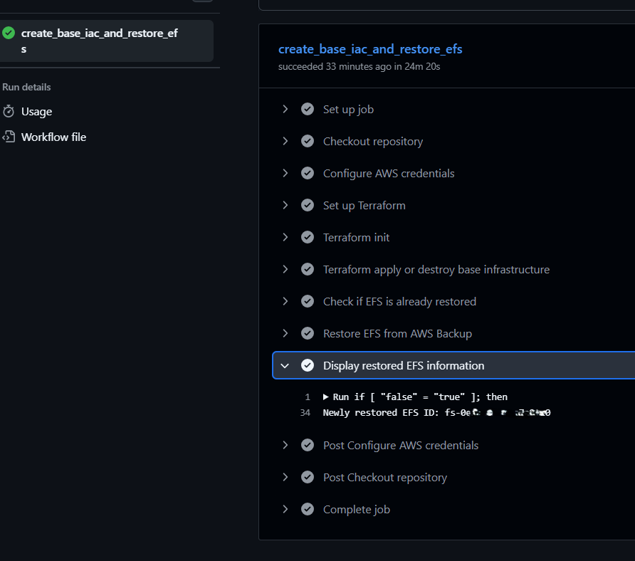
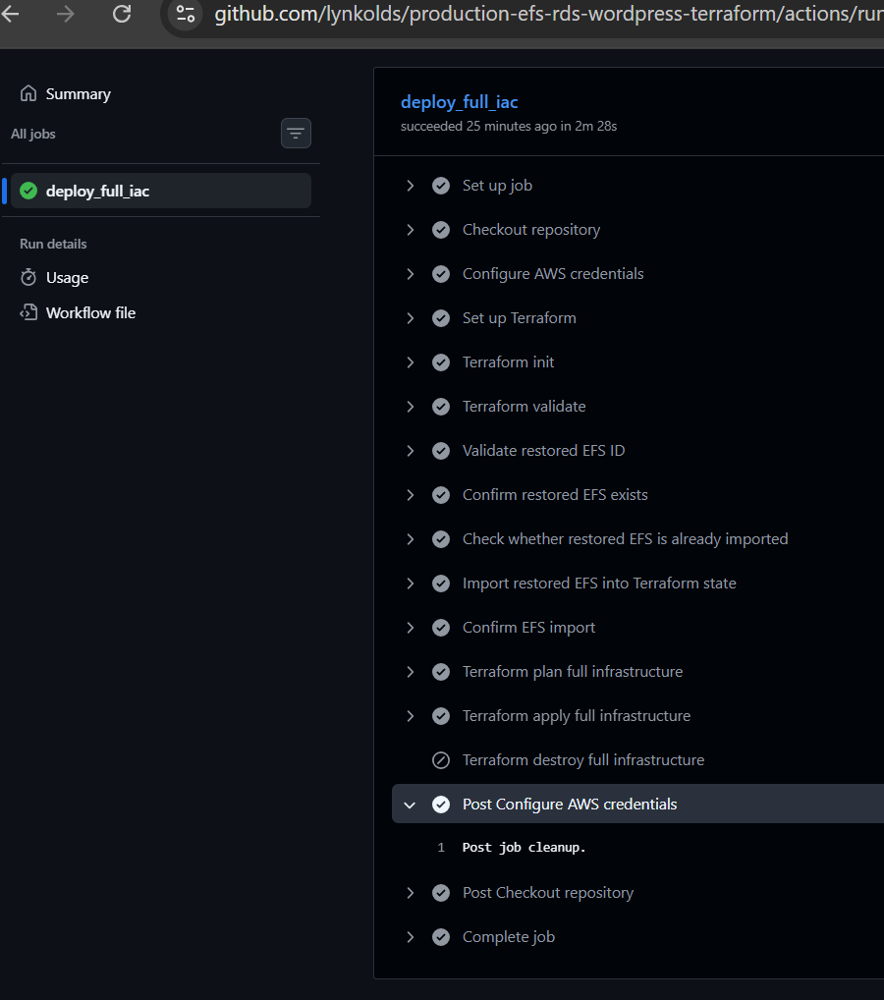
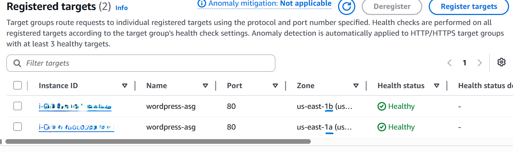
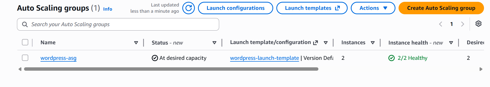
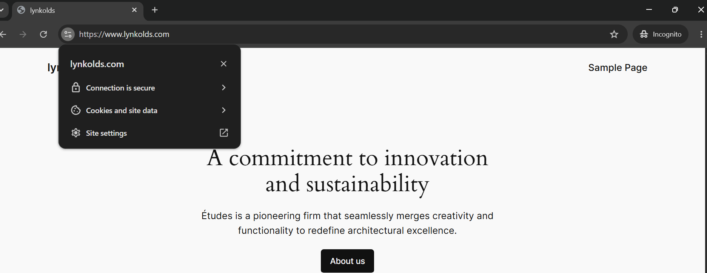

# Production-Ready AWS WordPress Infrastructure with Terraform and GitHub Actions

<a id="architecture-diagram"></a>



## Project Overview

This project demonstrates using GitHub Actions and Terraform to deploy a production-style WordPress deployment on AWS featuring a secure, scalable, and highly available three-tier  architecture across two availability zones.

It is an infrastructure as code (IaC) and continous integration and continous deployment (CI-CD) improvement on [this project](https://github.com/lynkolds/production-aws-wordpress-efs-rds).

The solution separates application, database, and user-generated content into dedicated AWS services:

* WordPress Core, Themes, and Plugins → Amazon EC2 / AMI
* WordPress Uploads → Amazon EFS
* WordPress Database → Amazon RDS MySQL
* HTTPS Traffic → Application Load Balancer + AWS Certificate Manager
* DNS Routing → Amazon Route 53
* Configuration Management → AWS Systems Manager Parameter Store
* High Availability → Auto Scaling Group across two Availability Zones
* Amazon EFS → scheduled backup with AWS Backup

## Table of Contents

1. [Architecture Diagram](#architecture-diagram)
2. [Project Overview](#project-overview)
3. [Core AWS Services](#core-aws-services)
4. [Key Design and Security Decisions](#key-design-and-security-decisions)
5. [Request Flow](#request-flow)
6. [Repository Structure](#repository-structure)
7. [Prerequisites](#prerequisites)
8. [Secrets Management](#secrets-management)
9. [Infrastructure Components](#infrastructure-components)
10. [Deployment Guide](#deployment-guide)
11. [Troubleshooting Guide](#troubleshooting-guide)
12. [Future Enhancements](#future-enhancements)
13. [Tech Stack](#tech-stack)

## Core AWS Services

* Amazon VPC
* Public and Private Subnets
* Internet Gateway
* NAT Gateways
* IAM
* Amazon EC2
* Amazon EFS
* AWS Backup
* Amazon RDS
* Application Load Balancer
* AWS Certificate Manager
* Auto Scaling Group
* AWS Systems Manager Parameter Store
* Amazon Route 53
* Amazon SNS 
* Amazon CloudWatch Alarms

## Key Design and Security Decisions

* Web servers deployed in private subnets
* Database deployed in separate private subnets
* EFS deployed across two Availability Zones
* Security groups enforce least-privilege network access between the ALB, EC2 instances, RDS database, EFS mount targets, and other application components.
* ALB is internet-facing
* RDS Instance is not publicly accessible
* User uploads stored on EFS
* WordPress core files stored in the AMI
* No credentials baked into the AMI
* Runtime configuration retrieved from Systems Manager Parameter Store
* Database password is stored as a secure string in Systems Manager Parameter Store
* IAM permissions restricted to required Parameter Store resources
* HTTPS enforced using ACM certificates and an ALB HTTPS listener
* AWS Backup backs up Amazon EFS file system on schedule.

## Request Flow
```
End Users
      ↓
Amazon Route 53
      ↓
Application Load Balancer
(HTTPS via ACM)
      ↓
Auto Scaling Group
(WordPress EC2 Instances)
      ├── Amazon RDS MySQL Multi-AZ
      └── Amazon EFS
              ↓
         AWS Backup
```

## Repository Structure

```
project-root/
├── .github/workflows/                          # GitHub Actions CI/CD workflow files
├── bash-scripts/
|         └── launch-template-user-data.sh      # user-data script for ASG launch template
├── images/                                     # Architecture diagram and screenshots
├── terraform/                                  # Infrastructure code
│   ├── iac/
│   └── next-iac/
├── .gitignore
└── README.md
```
---

## Prerequisites

- AWS account
- Existing Route 53 hosted zone and registered domain
- Existing validated ACM certificate
- Existing RDS snapshot
- Existing Amazon EFS recovery point
- Preconfigured AMI
- Existing AWS Systems Manager Parameter Store parameters
- Preconfigured IAM roles with Parameter Store and AWS Backup permissions
- Configured AWS CLI
- Terraform installed
- GitHub account
- Git installed and configured
- Existing S3 bucket for Terraform remote state storage
- Existing DynamoDB table for Terraform state locking


## Secrets Management
Secrets needed for the workflow are stored as environment secrets on the Github repository.

These include:
```
AWS_ACCESS_KEY_ID             = of the the IAM User
AWS_SECRET_ACCESS_KEY         = of the the IAM User

CERTIFICATE_ARN               = of the SSL certificate for the domain name

EFS_ID                        = of the restored EFS file system

EFS_RECOVERY_POINT_ARN        = arn of the EFS file system's recovery point

AWS_BACKUP_RESTORE_ROLE_ARN   = arn of the AWS managed backup role
 
RDS_MASTER_PASSWORD           = new password for the restored RDS Instance

WORDPRESS_AMI_ID              = ID of the preconfigured AMI.
SNS_EMAIL_ENDPOINT            = email address for SNS subscription
```

Parameters expected by the AMI and user data are:
```
/wordpress/db/host              = RDS Instance endpoint
/wordpress/db/name              = Wordpress Database name
/wordpress/db/master_user       = RDS Instance username
/wordpress/db/master_password   = RDS Instance password
/wordpress/prod/domain_name     = https://www.domainname.com
/wordpress/efs/id               = EFS file system ID
```
> Only `/wordpress/db/master_password` is stored as a `SecureString`. All other parameters are stored as `String` values.

## Infrastructure Components
Terraform provisions:
* VPC (Multi-AZ)
* Public subnets (ALB, NAT)
* Private subnets (EC2 Instances and EFS Mount Targets)
* DB subnets (RDS)
* Internet Gateway + NAT Gateways
* Route tables
* Security groups
* Application Load Balancer
* AWS Certificate Manager
* Amazon EFS Mount Targets
* AWS Backup
* RDS (from snapshot)
* Auto Scaling Group
* Amazon Route 53
* Amazon SNS 
* Amazon CloudWatch Alarms

Note: 
- AWS Systems Manager Parameter Store parameters and IAM roles used by the Auto Scaling Group instances and AWS Backup are referenced and consumed by this infrastructure, but are not created by Terraform in this project.

### GitHub Actions CI/CD
Workflow Type

This repository uses `workflow_dispatch` workflows to enable controlled and intentional CI/CD executions for infrastructure provisioning and deployments.


Pipeline Overview

```text
Manual Trigger
   ↓
create-base-iac-restore-efs.yml
   ├── Deploys the core infrastructure.
   ├── Restores the Amazon EFS file system from an existing recovery point.
   └── Does not create EFS mount targets yet.

   ↓
deploy-full-iac.yml
   ├── Imports the restored EFS file system into Terraform state.
   ├── Creates the remaining infrastructure.
   ├── Creates EFS mount targets in the private application subnets.
   ├── Retrieves the existing IAM roles required by AWS Backup and the EC2
   │   instances in the Auto Scaling group.
   ├── Creates the AWS Backup plan and backup vault for the EFS file system.
   └── Deploys the Auto Scaling group.
```

### Terraform in CI/CD

- `terraform apply/destroy` is controlled via input
- `EFS_ID`, stored as environment secret, is used to import the file system into Terraform state.
- `tfstate` S3 bucket and dynamodb table details are stored as environment variables in the Github Repository.

##  Deployment Guide

##  1. Configure Terraform 

#### Terraform State Management
This project uses a remote backend:
- S3 bucket → stores Terraform state
- DynamoDB table → provides state locking

The S3 bucket and DynamoDB table must already exist before either workflow file is run.

#### In the Github repository, add environment variables:

```
TF_STATE_BUCKET = Name of the S3 bucket used to store Terraform state
TF_STATE_KEY    = Path and filename of the Terraform state file
TF_LOCK_TABLE   = Name of the DynamoDB table used for state locking
```
Example:
```
TF_STATE_BUCKET = wordpress-tf-state-bucket

TF_STATE_KEY    = wordpress/terraform.tfstate

TF_LOCK_TABLE   = wordpress-dynamodb-table
```
#### In `create-base-iac-restore-efs.yml`, modify the `environment` name and:
```
TF_VAR_region: us-east-1
TF_VAR_project_name: wordpress
TF_VAR_environment: dev
TF_VAR_vpc_cidr: 10.0.0.0/16
TF_VAR_public_subnet_az1_cidr: 10.0.0.0/24
TF_VAR_public_subnet_az2_cidr: 10.0.1.0/24
TF_VAR_private_app_subnet_az1_cidr: 10.0.2.0/24
TF_VAR_private_app_subnet_az2_cidr: 10.0.3.0/24
TF_VAR_private_data_subnet_az1_cidr: 10.0.4.0/24
TF_VAR_private_data_subnet_az2_cidr: 10.0.5.0/24

TF_VAR_database_snapshot_identifier: 
TF_VAR_database_instance_class: db.t3.micro
TF_VAR_database_instance_identifier: 
TF_VAR_multi_az_deployment: true

TF_VAR_rds_master_password: ${{ secrets.RDS_MASTER_PASSWORD }}

TF_VAR_target_type: instance
TF_VAR_certificate_arn: ${{ secrets.CERTIFICATE_ARN }}

TF_VAR_domain_name: lynkolds
TF_VAR_record_name: www
```

#### In `deploy-full-iac.yml` file, modify the `environment` name and:

```
TF_VAR_region: us-east-1
TF_VAR_project_name: wordpress
TF_VAR_environment: dev
TF_VAR_vpc_cidr: 10.0.0.0/16
TF_VAR_public_subnet_az1_cidr: 10.0.0.0/24
TF_VAR_public_subnet_az2_cidr: 10.0.1.0/24
TF_VAR_private_app_subnet_az1_cidr: 10.0.2.0/24
TF_VAR_private_app_subnet_az2_cidr: 10.0.3.0/24
TF_VAR_private_data_subnet_az1_cidr: 10.0.4.0/24
TF_VAR_private_data_subnet_az2_cidr: 10.0.5.0/24

TF_VAR_database_snapshot_identifier: 
TF_VAR_database_instance_class: db.t3.micro
TF_VAR_database_instance_identifier: 
TF_VAR_multi_az_deployment: true

TF_VAR_rds_master_password: ${{ secrets.RDS_MASTER_PASSWORD }}

TF_VAR_target_type: instance
TF_VAR_certificate_arn: ${{ secrets.CERTIFICATE_ARN }}

TF_VAR_domain_name: lynkolds.com
TF_VAR_record_name: www

TF_VAR_wordpress_ec2_iam_role_name: 
TF_VAR_wordpress_ec2_instance_profile_name: 

TF_VAR_wordpress_ami_id: ${{ secrets.WORDPRESS_AMI_ID }}
TF_VAR_instance_type: t3.micro
TF_VAR_asg_desired_capacity: 2
TF_VAR_asg_min_size: 2
TF_VAR_asg_max_size: 4
TF_VAR_sns_email_endpoint: ${{ secrets.SNS_EMAIL_ENDPOINT }}
```
## 2. Configure GitHub Secrets
Add secrets:
```
AWS_ACCESS_KEY_ID             = of the the IAM User
AWS_SECRET_ACCESS_KEY         = of the the IAM User

CERTIFICATE_ARN               = of the ssl certificate for the domain name

EFS_RECOVERY_POINT_ARN        = arn of the EFS file system's recovery point

AWS_BACKUP_RESTORE_ROLE_ARN   = arn of the AWS managed backup role
 
RDS_MASTER_PASSWORD           = new password for the restored RDS Instance

WORDPRESS_AMI_ID              = ID of the preconfigured AMI.
SNS_EMAIL_ENDPOINT            = email address for SNS subscription
```
`EFS_ID` will be added after it has been output by the first workflow.

## 3. IAM User permissions
To restore the Amazon EFS file system, the IAM user used by the GitHub Actions workflow requires:

- The AWS-managed `AWSBackupOperatorAccess` policy.
- An inline IAM policy that allows the user to pass the AWS Backup service role to AWS Backup using `iam:PassRole`.
- An exemption in the backup vault access policy from any default explicit-deny statement that would otherwise prevent the user from starting the restore operation.

## 4. Run the Workflows in Order
### I.
- Run `Create Base IaC and Restore EFS` workflow.
- Copy the restored EFS file system ID from the workflow output.
- Add the value as the `EFS_ID` GitHub Actions environment secret.



### II.
- Update the `/wordpress/efs/id` parameter in AWS Systems Manager Parameter Store with the restored EFS_ID.
- Confirm that the existing RDS Parameter Store values match the values required by the restored RDS instance.
- Move the following Terraform files from `terraform/next-iac/` to `terraform/iac/`:
```
asg.tf
backup.tf
efs.tf
iam.tf
```
- In `variables.tf`, uncomment the following variables:

```
wordpress_ec2_iam_role_name
wordpress_ec2_instance_profile_name

wordpress_ami_id
instance_type
asg_desired_capacity
asg_min_size
asg_max_size
sns_email_endpoint
```
- Commit and push the changes to GitHub.
- Run the `Deploy Full AWS Infrastructure` workflow.




## Verification Checklist

* HTTPS access works
* Auto Scaling launches instances successfully
* EFS mounts correctly
* WordPress uploads function correctly
* Database connectivity works
* Target Group health checks pass







## Troubleshooting Guide

### Problem: EFS Restore Job Fails

**Possible Solutions:**

* Review the restore job status and error message in the workflow logs or AWS Backup console.
* Confirm that the IAM user used by the GitHub Actions workflow has the required AWS Backup permissions.
* Confirm that the IAM user has permission to pass the AWS Backup service role using `iam:PassRole`.
* Verify that the IAM user is exempt from any explicit-deny statement in the backup vault access policy.
* Confirm that AWS Backup restore role ARN and recovery point ARN are correct.
* Verify that GitHub Actions secrets do not contain trailing spaces, quotation marks, or typographical errors.
* Confirm that the AWS Backup restore metadata contains the required values, including the EFS KMS key identifier or alias when encryption is enabled.

---

### Problem: User Data Script Fails During EC2 Launch

**Possible Solutions:**

* Confirm that the EC2 instance received the user data script:

  ```bash
  sudo cat /var/lib/cloud/instance/scripts/part-001
  ```

* Check the cloud-init status:

  ```bash
  sudo cloud-init status --long
  ```

* Review the most recent user data and cloud-init output:

  ```bash
  sudo tail -n 150 /var/log/cloud-init-output.log
  ```

* Review the main cloud-init log:

  ```bash
  sudo tail -n 150 /var/log/cloud-init.log
  ```

* Verify that all required packages and dependencies were installed successfully.

* Confirm that the user data script uses the correct file paths, parameter names, AWS Region, and EFS file system ID.

* Confirm that the IAM instance profile is attached to the EC2 instances launched by the Auto Scaling group.
* Confirm the IAM instance profile name is correct.

* Verify that the IAM role associated with the instance profile has permission to retrieve the required Parameter Store values.

* Confirm that Parameter Store values do not contain typographical errors or unintended leading or trailing spaces.


---

### Problem: EFS DNS Hostname Cannot Be Resolved

**Possible Solutions:**

* Confirm that the EFS file system ID value in the parameter store is correct.
* Confirm that the EFS file system and EC2 instance are in the same AWS Region.
* Verify that DNS resolution and DNS hostnames are enabled for the VPC.
* Confirm that EFS mount targets exist in the Availability Zones used by the EC2 instances.

---

### Problem: Parameter Store Values Cannot Be Retrieved

**Possible Solutions:**

* Verify that the parameter names exactly match those referenced in the user data script.

* Confirm that the parameters exist in the expected AWS Region.

* Verify that parameter values contain no typographical errors or unintended leading or trailing spaces.

* Confirm that the EFS file system ID is stored as a **String** parameter rather than a **SecureString**.

* Ensure that SecureString parameters are retrieved using `--with-decryption`.

* Store the RDS password as a **SecureString** and retrieve it using `--with-decryption`.

* Confirm that the IAM instance profile is attached to the EC2 instances.

* Verify that the EC2 IAM role includes the required permissions:

  ```text
  ssm:GetParameter
  ssm:GetParameters
  kms:Decrypt
  ```

* Confirm that `kms:Decrypt` allows access to the KMS key used to encrypt the SecureString parameter.

---

### Problem: EFS Mount Fails

**Possible Solutions:**

* Verify that the EFS file system ID is correct.

* Confirm that the EFS file system exists in the expected AWS Region.

* Confirm that the AMI has `amazon-efs-utils` package installed.

* Verify that EFS mount targets exist in the Availability Zones used by the EC2 instances.

* Confirm that the EFS mount target security group allows inbound NFS traffic on TCP port 2049 from the EC2 security group.

* Verify that the mount directory exists:

  ```bash
  sudo mkdir -p /var/www/html/wp-content/uploads
  ```

* Check whether the EFS file system is mounted:

  ```bash
  mount | grep /var/www/html/wp-content/uploads
  ```

* Review the EFS mount helper log:

  ```bash
  sudo tail -n 150 /var/log/amazon/efs/mount.log
  ```

---

### Problem: WordPress Cannot Connect to the Database

**Possible Solutions:**

* Verify the RDS endpoint, database name, username, and password.
* Confirm that the Parameter Store values match the restored RDS instance.
* Verify that the WordPress database exists in the RDS instance.
* Confirm that the RDS instance is in the **Available** state.
* Verify that the database values were correctly added to `wp-config.php`.


---

## Future Enhancements

* AWS WAF to protect against web application attacks, bot traffic, brute-force login attempts, and common OWASP threats.
* Secrets Manager Integration for automatic rotation of database password.

---

## Tech Stack

* Github Action
* Terraform 
* Amazon EC2
* Amazon EFS
* Amazon RDS MySQL
* Application Load Balancer
* Auto Scaling Group
* Route 53
* AWS Certificate Manager
* AWS Systems Manager Parameter Store
* AWS Backup
* Apache
* PHP
* WordPress